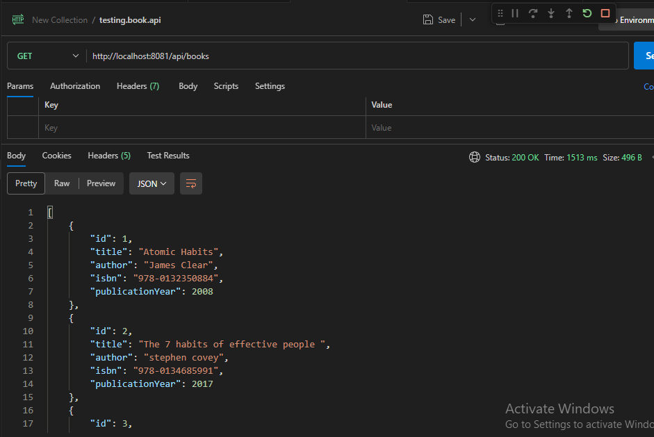
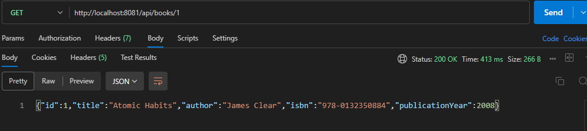
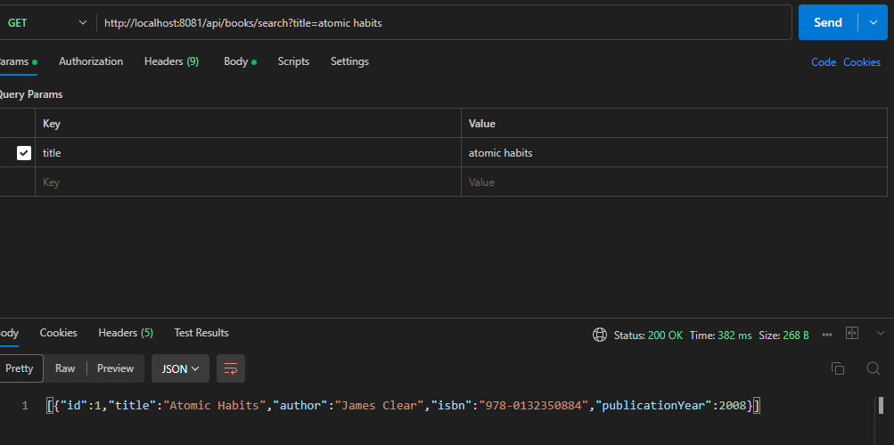
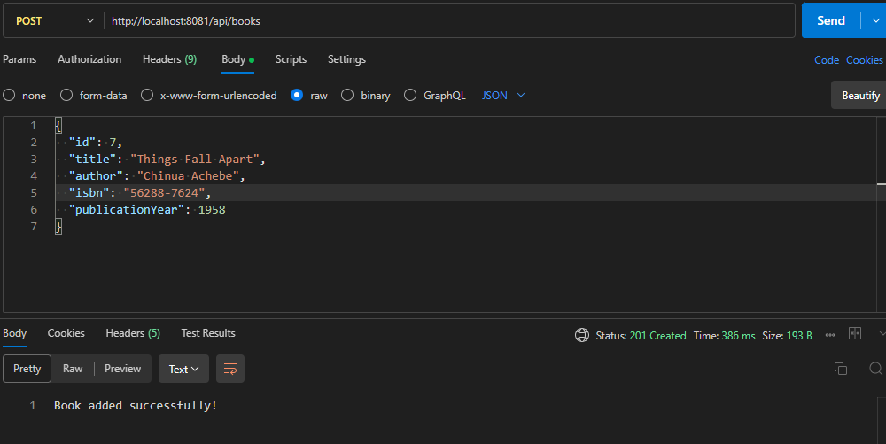
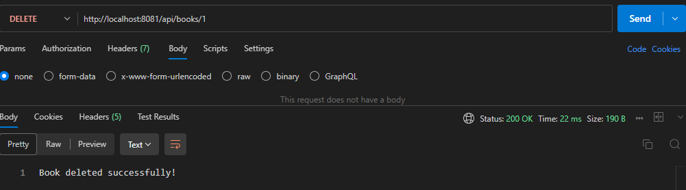

Question 1: Library Book Management API
.........................................

Project Overview
This is a RESTful API built with Spring Boot for a library management system. It demonstrates the use of Spring Web to handle HTTP requests and manage an in-memory collection of books.

## Project Structure
* **Model**: `library.question1_library_api.model.Book`
* **Controller**: `library.question1_library_api.controller.BookController`

## How to Run the Application
1. **Open the project** in VS Code.
2. Ensure you have **JDK 17 or 21** installed and matched in your `pom.xml`.
3. Locate `src/main/java/library/question1_library_api/Question1LibraryApiApplication.java`.
4. **Run** the main method.
5. The application starts on **port 8081**.

## API Endpoints List

| Method | Endpoint | Description |

| GET | `/api/books` | to display all books in the library 
| GET | `/api/books/{id}` | Get a specific book by its ID 
| GET | `/api/books/search?title={title}` | Search for books by title keyword 
| POST | `/api/books` | Add a new book to the library 
| DELETE | `/api/books/{id}` | Remove a book by its ID 

## Sample Request & Response
 1. Get All Books
 ....................

Request:  http://localhost:8081/api/books

Response:

   

   2. get book by id 
   ...........................

   request : http://localhost:8081/api/books/1   // to display book with id 1

     // i used GET method 
   response:
   

   
 3. search book by title
 ........................

 request: http://localhost:8081/api/books/search?title=atomic habits

 

 4. add new book
 .....................

 request:  http://localhost:8081/api/books   // i used POST Method

   I chosen    JSON  type 
{
  "id": 7,
  "title": "Things Fall Apart",
  "author": "Chinua Achebe",
  "isbn": "56288-7624",
  "publicationYear": 1958
}

 response:
 

5. Delete book by id
.........................

request:  http://localhost:8081/api/books/1
  // i used DELETE method  to delete the book of id = 1
response:

