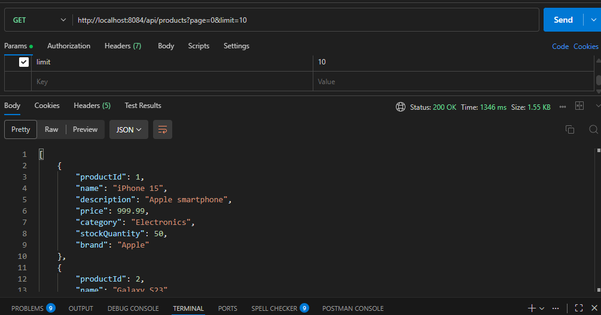
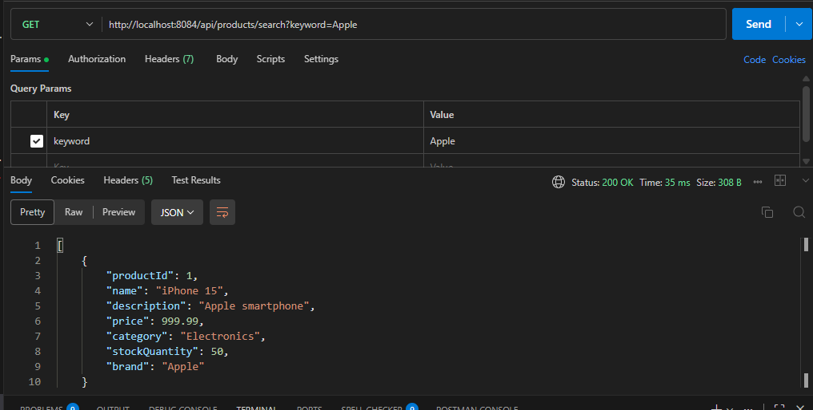

Question 4: E-Commerce Product API
===================================
Project Description
=========================
This is a Spring Boot RESTful API developed for an e-commerce product catalog. It manages a variety of products across different categories and brands, featuring advanced search capabilities, price range filtering, and inventory management.

 Features Implemented

 =====================
- Full CRUD Operations: Create, Read, Update, and Delete products.
- Advanced Filtering: 
    - Filter products by **Category** or **Brand**.
    - Search by **Price Range** (min/max).
    - Filter for **In-Stock** items only (stock > 0).
- **Keyword Search**: Search functionality that checks for keywords in both the product name and description.
- **Pagination**: Support for paginated results using `page` and `limit` query parameters.
- **Partial Updates**: A `PATCH` endpoint to update only the stock quantity.

---

 API Endpoints
 ==================

 1. General Catalog
| Method | Endpoint | Description |
| :--- | :--- | :--- |
| **GET** | `/api/products` | Get all products (supports `?page=x&limit=y`) |
| **GET** | `/api/products/{productId}` | Get specific product details |
| **POST** | `/api/products` | Add a new product |
| **PUT** | `/api/products/{productId}` | Update existing product details |
| **DELETE** | `/api/products/{productId}` | Remove a product |

 2. Search & Filter
| Method | Endpoint | Query Parameters |
| :--- | :--- | :--- |
| **GET** | `/api/products/search` | `?keyword={text}` |
| **GET** | `/api/products/price-range` | `?min={val}&max={val}` |
| **GET** | `/api/products/in-stock` | (None) |

 3. Inventory Control
| Method | Endpoint | Query Parameters |
| :--- | :--- | :--- |
| **PATCH** | `/api/products/{id}/stock` | `?quantity={number}` |

---

Sample Product 
============
1. Get Products

http://localhost:8084/api/products?page=0&limit=10

result

2. Search Products

http://localhost:8084/api/products/search?keyword=Apple

result

